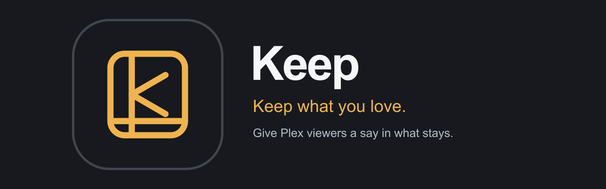
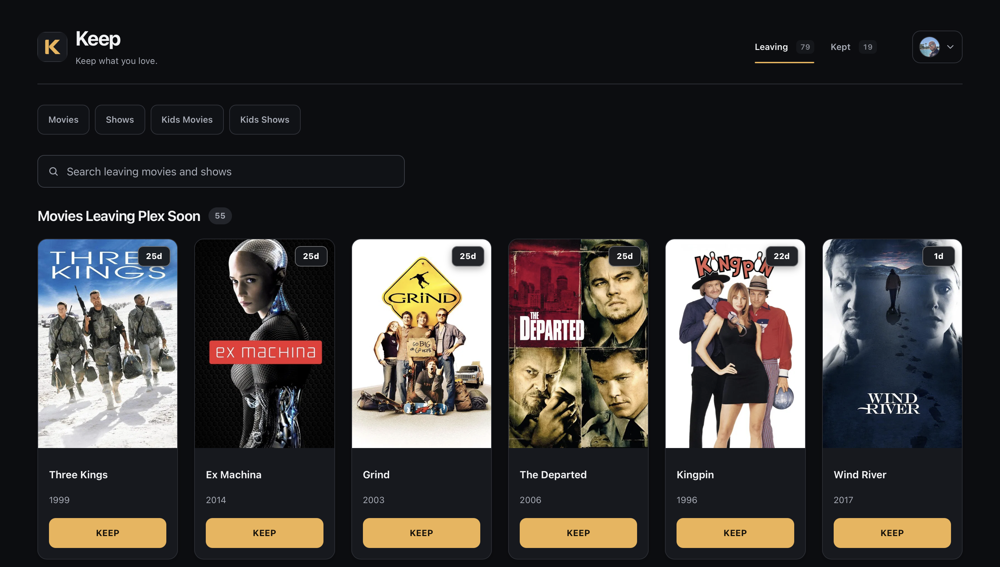

# Keep

Keep gives the people who use your Plex server a say in what stays and what goes.

Disk space is limited, and automated cleanup helps keep a media library manageable. But a movie or show someone still plans to watch can be removed before they get around to it. Keep was created to make that decision more personal: a simple, interactive way to see what's leaving and give a title more time.

Keep is a self-hosted companion for Plex and Maintainerr. Viewers sign in, browse titles scheduled for removal, and choose what they want to keep. A 30-day Keep buys time to watch; owners can also allow indefinite protection. Maintainerr continues to handle the cleanup rules, while Keep gives viewers an easy way to protect the titles that matter to them.

When it's time to make room, **Manage Library** lets people with the owner's permission delete movies, shows, or selected seasons they no longer want. Access can be limited to specific libraries and a person's own Seerr requests. Active Keeps are checked before deletion, and every deletion requires confirmation.

- **See what's leaving.** Browse selected Maintainerr collections and the time remaining before possible removal.
- **Keep your watch plans.** Protect titles for 30 days, manage your Keeps, and see who kept each title.
- **Make space together.** Give trusted users controlled access to library cleanup through Radarr and Sonarr.
- **Stay informed.** Optional email summaries and watch history help people decide what to keep.

## Sign-in and access

Sign in with Plex using the account that owns the selected server or an account with access to that server. Having a Plex account alone does not grant access to Keep. Keep verifies server access for non-owner Plex accounts and rechecks it in the background. The owner can also disable an account in Keep.

The owner can create local Keep accounts that sign in with an email address and password, without requiring a Plex account or Plex server access. These accounts give access to Keep under the owner's chosen permissions; they do not grant access to watch media in Plex. There is no public account registration.

See the [features and access guide](docs/FEATURES.md) for account types, permissions, integrations, and how Keep protection and library cleanup work.

## Preview

**Leaving** — see what's leaving Plex and how much time remains to keep it.



[Browse the preview gallery](docs/PREVIEW.md) to see sign-in, light and dark mode, protected titles, and library cleanup.

## Before you install

Install these prerequisites on the computer where Keep will run:

- **Docker with Compose v2:** [Docker Desktop for macOS](https://docs.docker.com/desktop/setup/install/mac-install/) or [Windows](https://docs.docker.com/desktop/setup/install/windows-install/), or [Docker Engine](https://docs.docker.com/engine/install/) with the [Compose plugin](https://docs.docker.com/compose/install/linux/) on Linux. Start Docker before installing Keep; Windows must use Linux containers.
- **Python 3.9 or newer:** follow the official instructions for [Linux](https://docs.python.org/3/using/unix.html), [macOS](https://www.python.org/downloads/macos/), or [Windows](https://www.python.org/downloads/windows/). Python runs the installer; Keep itself runs inside Docker.
- **Linux / macOS:** [curl](https://curl.se/download.html) to download the installer. macOS already includes it; see [missing prerequisite help](docs/INSTALLATION.md#missing-prerequisites) if your shell cannot find it.
- **Windows:** [PowerShell 5.1 or newer](https://learn.microsoft.com/en-us/powershell/scripting/install/install-powershell-on-windows). Windows PowerShell 5.1 is sufficient; PowerShell 7 also works.
- **Your media services:** [Plex Media Server](https://www.plex.tv/media-server-downloads/) and [Maintainerr](https://docs.maintainerr.info/installation/) must already be running and reachable from Keep. They are installed separately.

Your account must be able to run Docker, and the computer needs internet access to download Keep. The installer checks prerequisites and stops with repair guidance if something is missing; it does not install those tools for you.

Keep starts on your local network. You do not need Git, a domain, or a reverse proxy to install it. Use HTTPS if you later make Keep accessible outside your trusted network.

## Install

After installing the prerequisites, run one command for your system on the computer where Keep will live. Then finish setup in your browser.

**Linux / macOS**

```sh
curl -fsSL https://raw.githubusercontent.com/brspoon/keep/2.23.1/install.sh | sh
```

**Windows — PowerShell**

```powershell
irm https://raw.githubusercontent.com/brspoon/keep/2.23.1/install.ps1 | iex
```

The installer downloads the release files into a `keep` folder in your home directory, creates private configuration and secrets, pulls the prebuilt image, and starts the web app and background worker. Once both services are healthy, it prints a local setup address and a temporary owner setup code.

1. Open the printed `/setup` address on your phone or computer on the same network. Enter the code printed by the installer, sign in with the Plex account that owns your server, and select that server.
2. On **Set up Keep**, select **Configure services and collections** to open **Admin → Connections**. Save and test Maintainerr, then choose and save at least one collection Keep should track.
3. Select **Return to Setup** and review the checklist. **Verify services and finish setup** becomes available once the required configuration is saved; the checklist explains anything still missing. Select it to verify Plex and the selected Maintainerr collections, plus SMTP if you enabled email. Select **Open Keep** after verification succeeds.

Radarr, Sonarr, Seerr, Tautulli, and email are optional. See the [installation guide](docs/INSTALLATION.md) to choose a port or address, use an HTTPS proxy, or troubleshoot setup. Keep the installation's `.env` file and data volume private, and back them up before upgrading.

## Guides

- [Features and access](docs/FEATURES.md) — understand sign-in, permissions, Keep protection, library cleanup, and integrations.
- [Preview gallery](docs/PREVIEW.md) — explore Keep's main views and actions in light and dark mode.
- [Documentation index](docs/README.md) — find installation, backup, migration, API, and contributor guides.
- [Installation and configuration](docs/INSTALLATION.md)
- [Backup and restore](docs/PORTABLE_BACKUP.md)
- [Upgrade and migration](docs/MIGRATION.md)
- [API guide](docs/API.md) and [OpenAPI specification](static/openapi.json)
- [Contributing](CONTRIBUTING.md) and [development and testing](docs/DEVELOPMENT_TESTING.md)
- [Security policy](SECURITY.md) and [supported versions](SUPPORT.md)
- [License](LICENSE) and [third-party notices](THIRD_PARTY.md)

Keep's own source code is licensed under MIT. Dependencies and bundled assets may have separate licenses and notices. Keep is independent of Plex, Maintainerr, Radarr, Sonarr, Seerr, and Tautulli; their names identify compatible services and do not imply endorsement.

Plex and the Plex logo are trademarks of Plex and used under a license.
