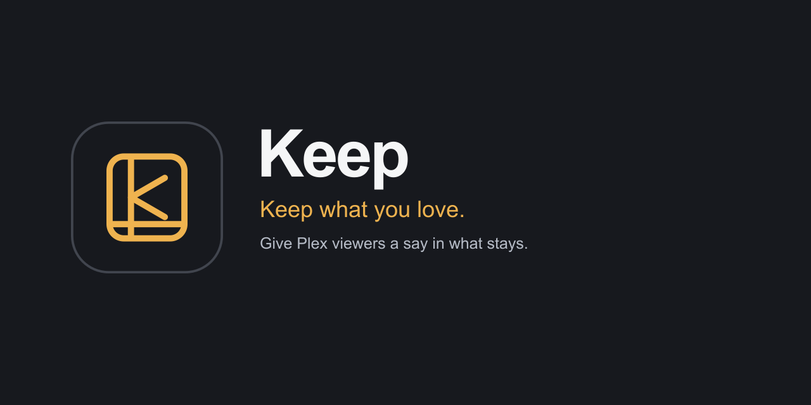

# Keep branding

Keep uses the approved sleeve mark in gold (`#efb34f`) on a charcoal tile (`#17191e`). Use the same tile in light mode, dark mode, and email. The canonical vector is [keep-icon.svg](../static/keep-icon.svg); preserve its geometry, color, and proportions.

Email headers use a white surface and dark text in light mode, with a charcoal surface and light text in dark mode. The logo tile itself keeps the same colors in both.

| Asset | Size | Use |
| --- | --- | --- |
| [Canonical vector](../static/keep-icon.svg) | 96×96 viewBox | App branding and source for raster icons |
| [Favicon](../static/favicon-32.png) | 32×32 | Browser tabs |
| [Apple touch icon](../static/apple-touch-icon.png) | 180×180 | Home screen icon |
| [192px icon](../static/keep-icon-192.png) | 192×192 | Web manifest and inline email logo, displayed at 64×64 |
| [512px icon](../static/keep-icon-512.png) | 512×512 | Web manifest |
| [Web manifest](../static/site.webmanifest) | — | App icon URLs, with a shared cache revision |
| [Social preview source](branding/social-preview.svg) | 1280×640 | Editable preview composition with the canonical vector embedded unchanged |
| [Social preview image](branding/social-preview.png) | 1280×640 | Prepared GitHub repository social preview |
| [Repository banner source](branding/repository-banner.svg) | 1280×400 | Shorter header composition with a larger canonical logo |
| [Repository banner image](branding/repository-banner.png) | 1280×400 | README and Docker Hub overview header |

## Regeneration

[generate_brand_icons.cjs](../scripts/generate_brand_icons.cjs) renders every PNG from its vector source and refreshes the canonical logo embedded in both preview compositions. Sharp **0.35.4** is developer tooling only; it is not an application or container dependency. The social preview and banner use Arial with Helvetica and sans-serif fallbacks; matching fonts are needed for byte-identical text rendering on another machine.

From the repository root, with Node.js 24 LTS and Sharp 0.35.4 available:

```sh
node scripts/generate_brand_icons.cjs
node scripts/generate_brand_icons.cjs --check
```

For tooling kept outside the checkout, point `NODE_PATH` at that installation's `node_modules` directory. `--check` regenerates in memory and compares the exact bytes without writing files. Review the favicon at its actual size, the larger icons, and both preview compositions after regeneration. Change the icon URLs' shared cache revision when publishing updated artwork.

## GitHub social preview

Use the social preview PNG in the repository’s **Settings → General → Social preview**. GitHub does not apply this file automatically; upload it there when publishing a brand update.


