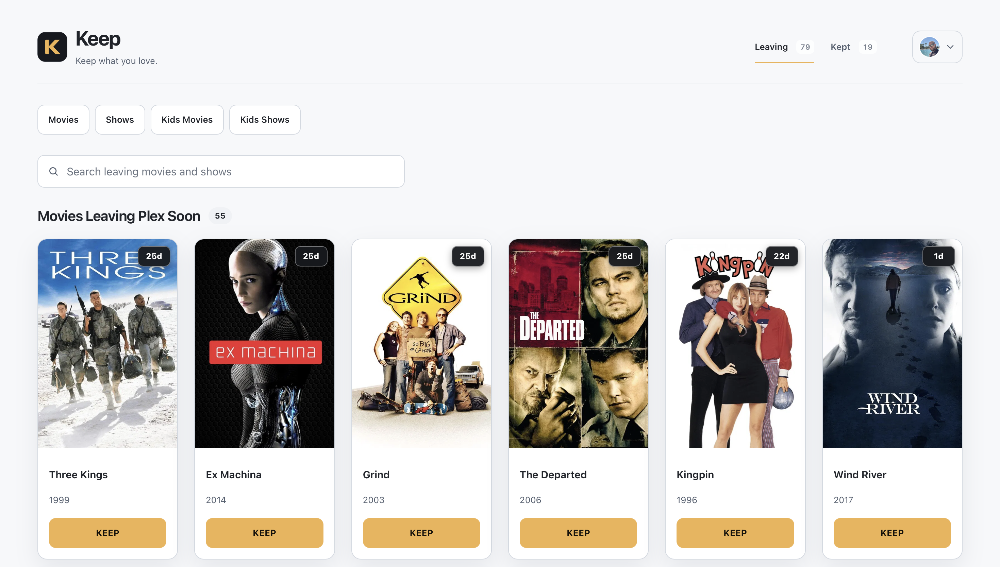
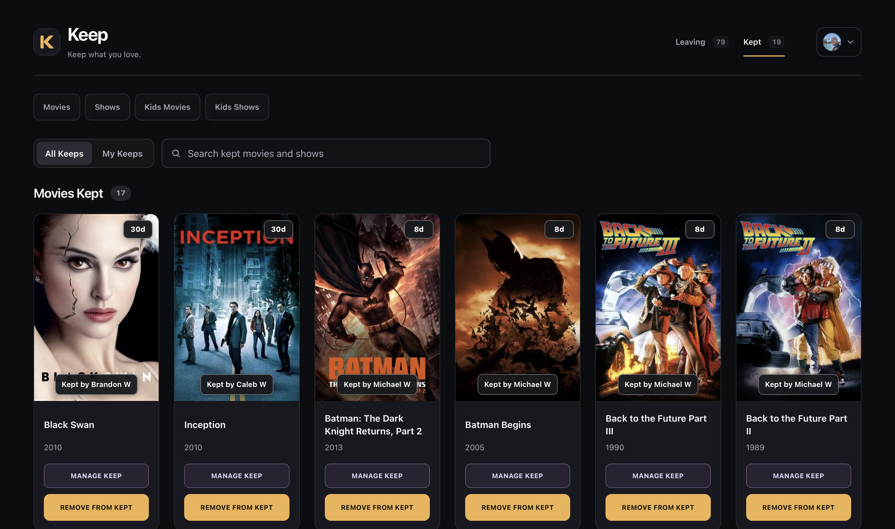
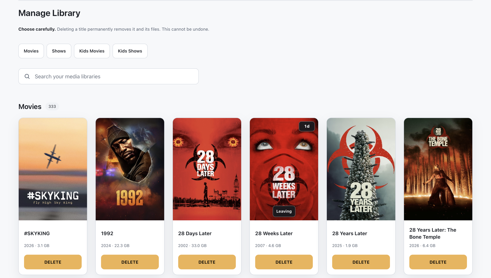
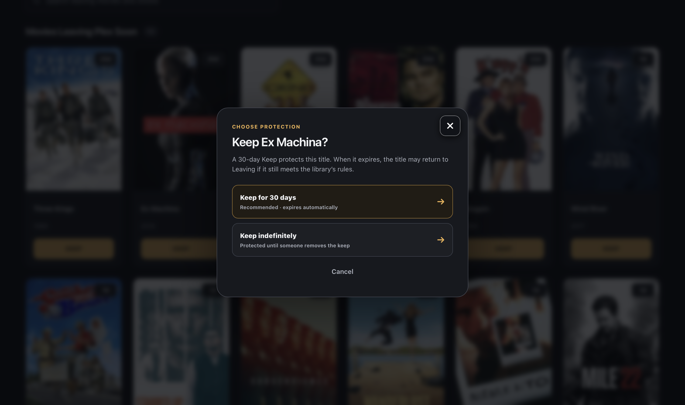
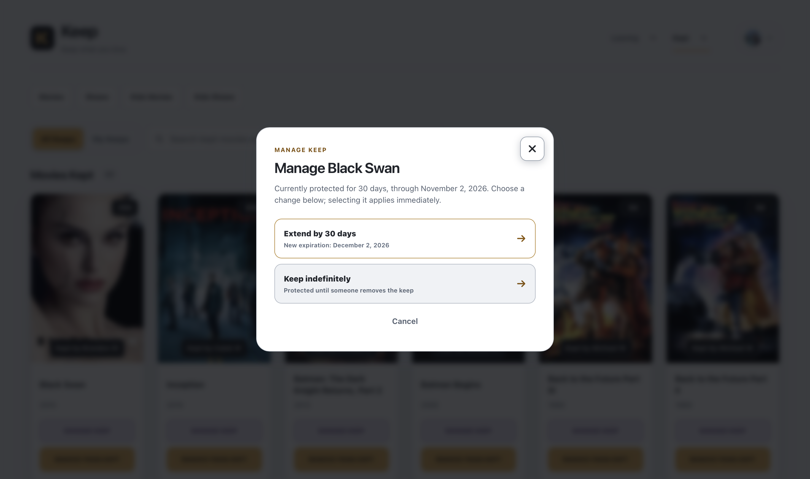
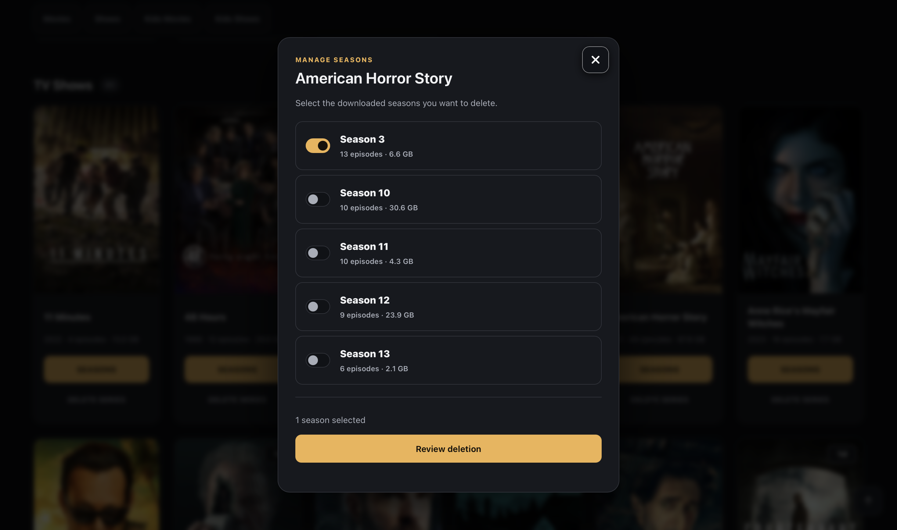
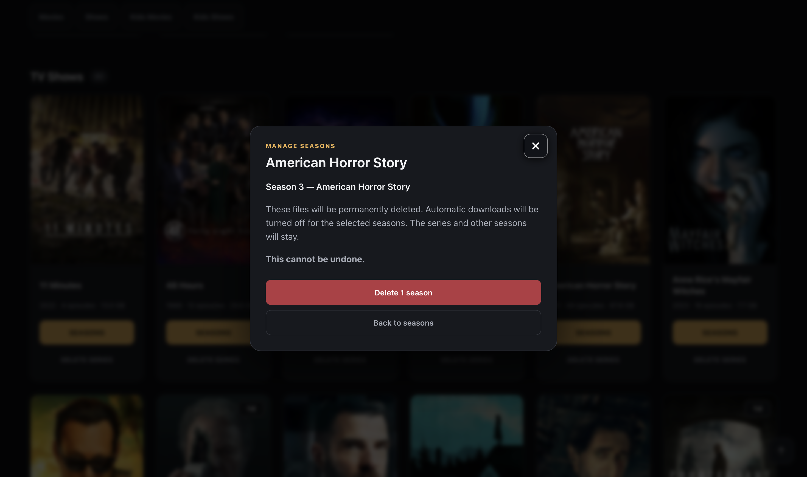

# Preview

Explore Keep's main features in these screenshots from a live installation. Titles, libraries, and available controls depend on the owner's configuration and your permissions. See [features, accounts, and permissions](FEATURES.md) for how these features work, or return to the [project README](../README.md).

## Leaving — dark mode

Browse titles scheduled to leave Plex, search your selected collections, and choose **Keep** for something you still plan to watch. The day badges show the time before possible removal.

## Leaving — light mode

The same Leaving view in light mode shows how Keep's appearance changes while keeping the familiar browsing and protection controls.

## Kept — dark mode

See protected titles, who kept them, and how long their Keeps last. Switch between **All Keeps** and **My Keeps**, manage protection when permitted, or remove a Keep. Removing protection does not delete the title.

## Manage Library — light mode

Review downloaded titles and their file sizes, search across your granted libraries, and choose what you no longer want. Deletion permanently removes media files and requires confirmation; your permissions determine which titles and actions are available.

## Choose protection — dark mode

A 30-day Keep gives you more time to watch. When the owner allows it, you can instead protect a title indefinitely until its Keep is removed.

## Manage Keep — light mode

Review a title's current protection and expiration, then extend it by 30 days when available. The dialog shows the new expiration before you choose. If the owner grants permission, you can also switch to indefinite protection.

## Manage seasons — dark mode

Choose downloaded seasons individually, compare their episode counts and file sizes, and review your selection before confirming deletion. The series and other seasons remain in place.

## Confirm season deletion — dark mode

Review the selected season before permanently removing its files. Confirming deletion also turns off automatic downloads for that season; the series and other seasons remain. Confirm with **Delete 1 season**, or choose **Back to seasons** to change your selection.

