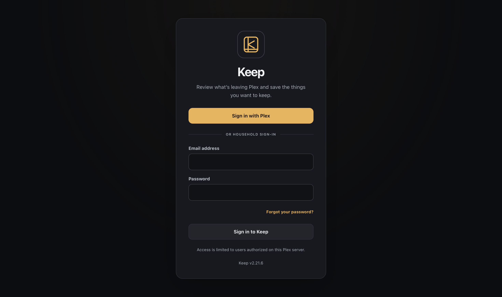
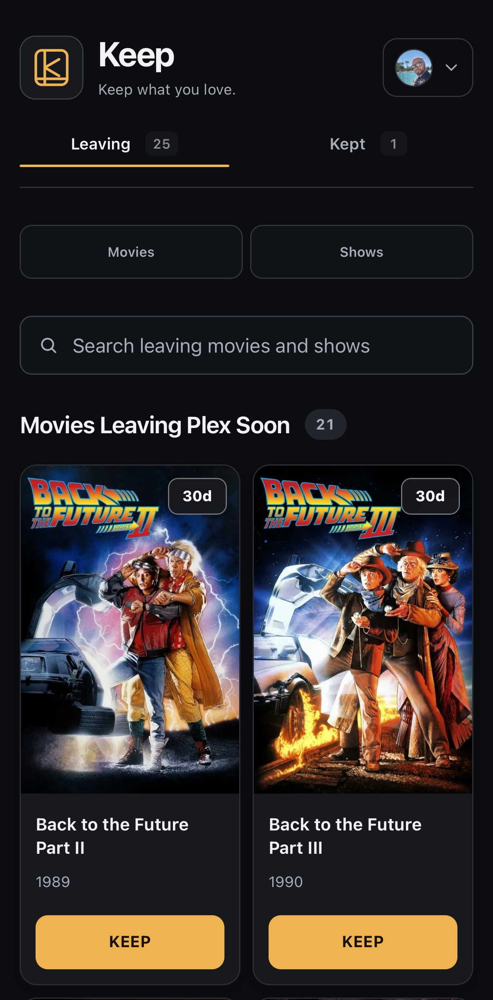
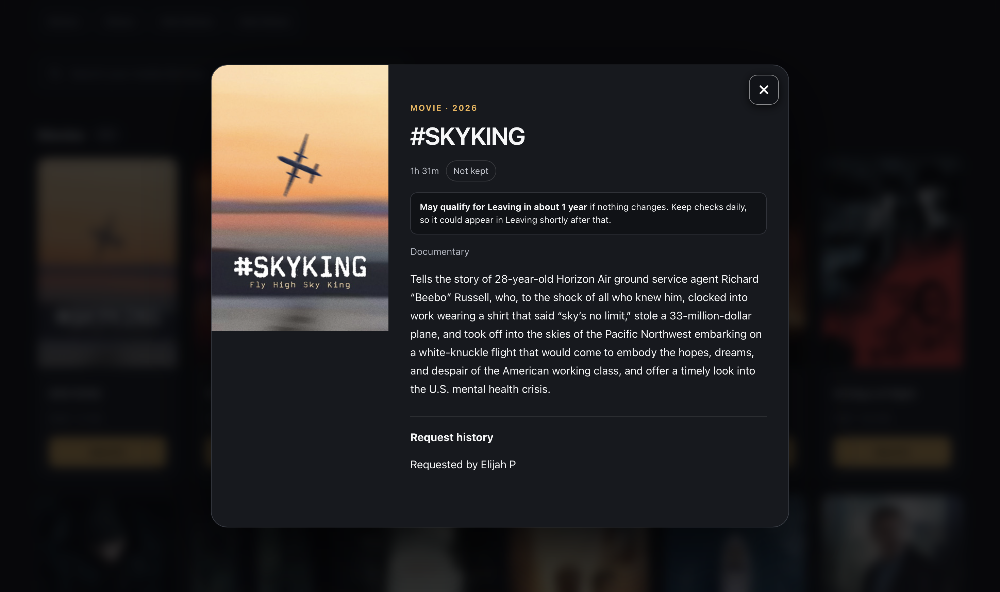
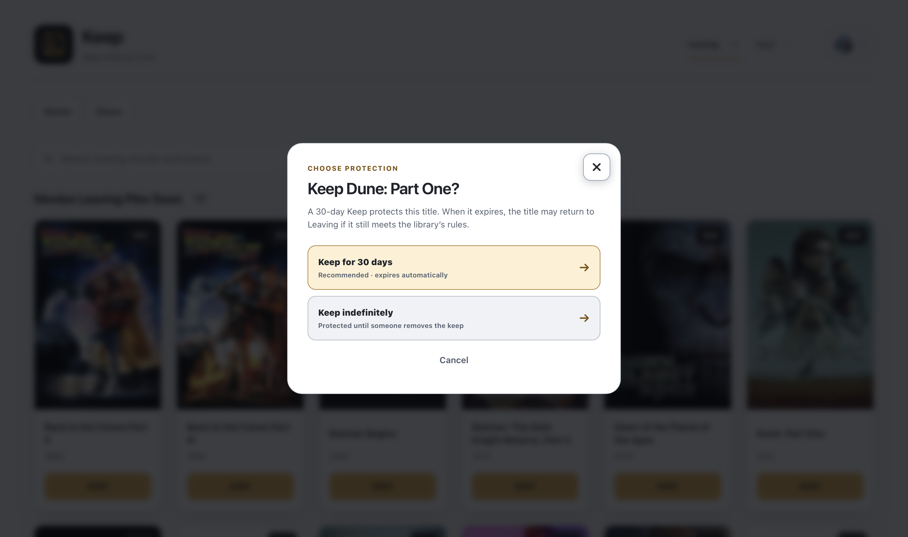
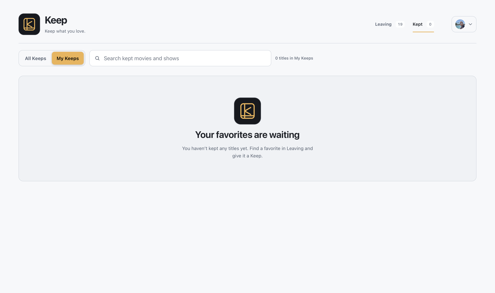

# Preview

Explore Keep's main features in these screenshots from a live installation. Titles, libraries, and available controls depend on the owner's configuration and your permissions. See [features, accounts, and permissions](FEATURES.md) for how these features work, or return to the [project README](../README.md).

## Sign in — dark mode

Sign in with Plex or use an email address and password for a local Keep account created by the owner. Access depends on your account and the owner's permissions.

## Leaving

Browse titles scheduled to leave Plex, search your selected collections, and choose **Keep** for something you still plan to watch. The day badges show the time before possible removal.

### Dark mode

### Light mode

The same Leaving view in light mode shows how Keep's appearance changes while keeping the familiar browsing and protection controls.

### On your phone — dark mode

Browse the same Leaving collections on your phone, with search, removal countdowns, and Keep buttons arranged for a smaller screen.

## Title details — dark mode

A title's details bring together its runtime, synopsis, Keep status, and available request history. When enough information is available, Keep can also estimate when it may qualify for Leaving if nothing changes.

## Choose protection

A 30-day Keep gives you more time to watch. When the owner allows it, you can instead protect a title indefinitely until its Keep is removed.

### Dark mode

### Light mode

## Kept — dark mode

See protected titles, who kept them, and how long their Keeps last. Switch between **All Keeps** and **My Keeps**, manage protection when permitted, or remove a Keep. Removing protection does not delete the title.

## My Keeps when empty — light mode

If you haven't kept any titles yet, **My Keeps** shows a note pointing you back to Leaving. Empty collections and their shortcuts stay hidden so the page focuses on what you can do next.

## Manage Library — light mode

Review downloaded titles and their file sizes, search across your granted libraries, and choose what you no longer want. Deletion permanently removes media files and requires confirmation; your permissions determine which titles and actions are available.

## Manage seasons — dark mode

Choose downloaded seasons individually, compare their episode counts and file sizes, and review your selection before confirming deletion. The series and other seasons remain in place.

## Confirm season deletion — dark mode

Review the selected season before permanently removing its files. Confirming deletion also turns off automatic downloads for that season; the series and other seasons remain. Confirm with **Delete 1 season**, or choose **Back to seasons** to change your selection.

